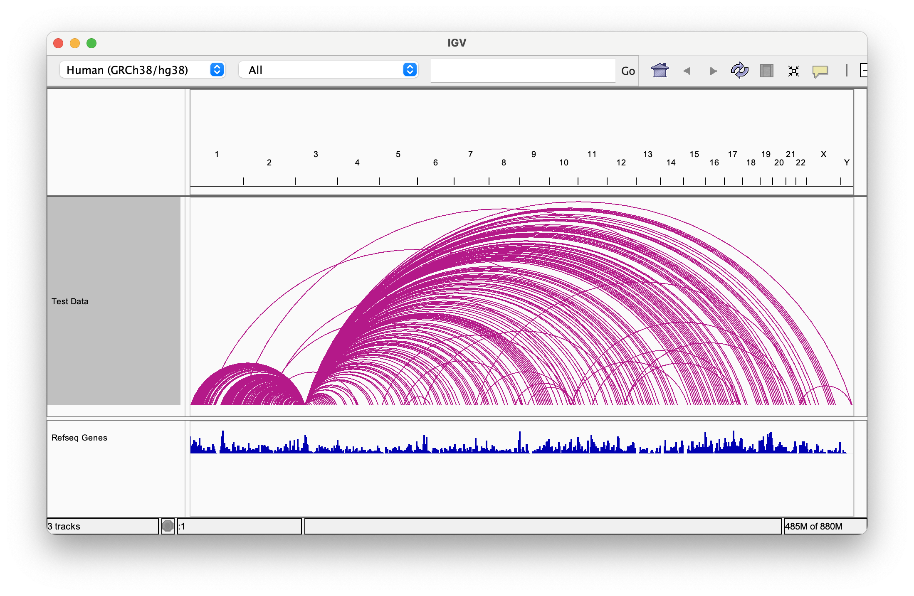

# fgsv

[![Bioconda][bioconda-badge-link]][bioconda-link]
[![Build Status][github-badge]][github-link]
[![Language][scala-badge]][scala-link]
[![License][license-badge]][license-link]
[![DOI][doi-badge]][doi-link]

[bioconda-badge-link]: https://img.shields.io/conda/dn/bioconda/fgsv.svg?label=Bioconda
[bioconda-link]:       http://bioconda.github.io/recipes/fgsv/README.html
[github-badge]:        https://github.com/fulcrumgenomics/fgsv/actions/workflows/unittests.yaml/badge.svg?branch=main
[github-link]:         https://github.com/fulcrumgenomics/fgsv/actions/workflows/unittests.yaml
[scala-badge]:         https://img.shields.io/badge/language-scala-c22d40.svg
[scala-link]:          https://www.scala-lang.org/
[license-badge]:       https://img.shields.io/badge/license-MIT-blue.svg
[license-link]:        https://github.com/fulcrumgenomics/fgsv/blob/main/LICENSE
[doi-badge]:           https://zenodo.org/badge/DOI/10.5281/zenodo.10452647.svg
[doi-link]:            https://zenodo.org/doi/10.5281/zenodo.10452647

Tools to gather evidence for structural variation via breakpoint detection.

<p>
<a href="https://fulcrumgenomics.com"></a>
</p>

[Visit us at Fulcrum Genomics](https://www.fulcrumgenomics.com) to learn more about how we can power your Bioinformatics with fgsv and beyond.

<a href="mailto:contact@fulcrumgenomics.com?subject=[GitHub inquiry]"></a>
<a href="https://www.fulcrumgenomics.com"></a>

## Documentation

More detailed documentation can be found in the [docs folder](docs/01_Introduction.md).

## Introduction to the `fgsv` Toolkit

The `fgsv` toolkit contains tools for effective structural variant investigation.
These tools are not meant to be used as a structural variant calling toolchain in-and-of-itself; instead, it is better to think of `fgsv` as a breakpoint detection and structural variant exploration toolkit.

> [!NOTE]
> When describing structural variation, we use the term **breakpoint** to mean a junction between two loci and the term **breakend** to refer to one of the loci on one side of a breakpoint.

> [!IMPORTANT]
> All point intervals (1-length) reported by this toolkit are 1-based inclusive from the perspective of the reference sequence unless otherwise documented.

### `SvPileup`

Collates pileups of reads over breakpoint events.

```console
fgsv SvPileup \
    --input sample.bam \
    --output sample.svpileup
```

The tool [`fgsv SvPileup`](https://github.com/fulcrumgenomics/fgsv/blob/main/docs/tools/SvPileup.md) takes a queryname-grouped BAM file as input and scans each query group (template) of alignments for structural variant evidence.
For a simple example: a paired-end read may have one alignment per read (one alignment for read 1 and another alignment for read 2) mapped to different reference sequences supporting a putative translocation.

Primary and supplementary alignments for a template are used to construct a “chain” of aligned sub-segments in a way that honors the sub-segments mapping locations and strandedness as compared to the reference sequence.
The aligned sub-segments in a chain relate to each other through typical alignment mechanisms like insertions and deletions but also contain information about the relative orientation of the sub-segment to the reference sequence and importantly, jumps between reference sequences which could indicate translocations.
See the [SAM Format Specification v1](https://samtools.github.io/hts-specs/SAMv1.pdf) for more information on how reads relate to alignments.

For each chain of aligned sub-segments per template, outlier jumps are collected where the minimum inter-segment jump distance within a read must be 100bp (by default) or greater, and the minimum inter-read jump distance (e.g. between reads in a paired-end read) must be 1000bp (by default) or greater.
At locations where these jumps occur, breakpoints are marked and given a unique ID based on the loci of the breakends and the directionality of the left and right strands leading into each breakend.
In the case where there is both evidence for a split-read jump and inter-read jump, the split-read alignment evidence is favored since it gives a precise breakpoint.
This process creates a collection of candidate breakpoint locations.

The tool outputs a table of candidate breakpoints and a BAM file with each alignment tagged with the ID of the breakpoint it supports (if any).

### `AggregateSvPileup`

Aggregates and merges pileups that are likely to support the same breakpoint.

```console
fgsv AggregateSvPileup \
    --bam sample.bam \
    --input sample.svpileup.txt \
    --output sample.svpileup.aggregate.txt
```

The tool [`fgsv AggregateSvPileup`](https://github.com/fulcrumgenomics/fgsv/blob/main/docs/tools/AggregateSvPileup.md) is used to aggregate nearby breakpoints into one event if they appear to support one true breakpoint.
This polishing step preserves true positive breakpoint events and is intended to reduce the number of false positive breakpoint events.

Aggregating breakpoints is often necessary because of variability in typical short-read alignments caused by somatic mutation, sequencing error, alignment artifact, or breakend sequence similarity/homology to the reference sequence.
Variability in short-read alignments means that it is not always possible to locate the exact nucleotide coordinate where either breakends in a breakpoint occur.
Instead, either breakend of a true breakpoint may map to a plausible region (instead of a point coordinate) and when this happens, the cluster of breakends could be aggregated to build up support for one true breakpoint.

Clustered breakpoints are only merged if their left breakends map to the same strand of the same reference sequence, their right breakends map to the same strand of the same reference sequence, and their left and right genomic breakend positions are both within a given length threshold of 10bp (by default).

One shortcoming of the existing behavior, which should be corrected at some point, is that intra-read breakpoint evidence is considered similarly to inter-pair breakpoint evidence even though intra-read breakpoint evidence often has nucleotide-level alignment resolution and inter-pair breakpoint evidence does not.

The tool outputs a table of aggregated breakpoints and a modified copy of the input BAM file where each alignment is tagged with the ID of the aggregate breakpoint it supports (if any).

### `AggregateSvPileupToBedPE`

Converts the output of `AggregateSvPileup` to the [BEDPE format](https://bedtools.readthedocs.io/en/latest/content/general-usage.html#bedpe-format).

```console
fgsv AggregateSvPileupToBedPE \
    --input sample.svpileup.aggregate.txt \
    --output sample.svpileup.aggregate.bedpe
```

The tool [`fgsv AggregateSvPileupToBedPE`](https://github.com/fulcrumgenomics/fgsv/blob/main/docs/tools/AggregateSvPileupToBedPE.md) is used to convert the output of `AggregateSvPileup` to BEDPE so that it can be viewed in [IGV](https://igv.org/) and other BEDPE-supporting genome browsers.
For example:


